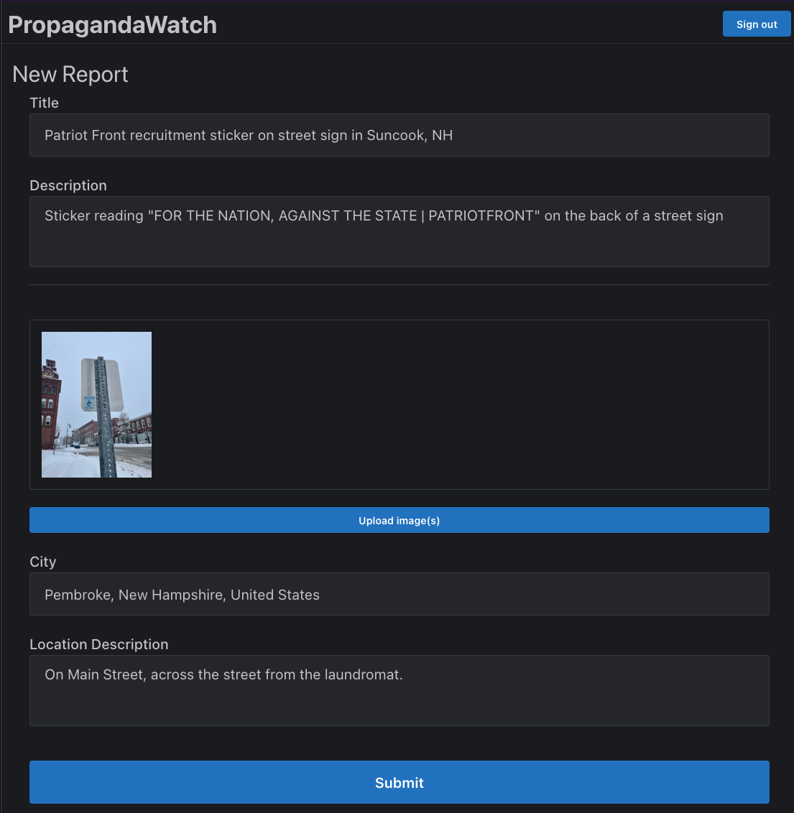

# propagandawatch

a work-in-progress, crowdsourced application for the tracking and removal of hate group propaganda, recruitment posters, etc.

> NOTE: yes, i know that the codebase is a disaster, with linting errors all over the place. i'll get around to cleaning it soon.

---

---

## roadmap

there's a lot - this is still in the "proof of concept" stage.

- disallow creation of reports for non-logged-in users
- implement an approval system
- implement a map view so users can see reports in their area
- significantly improve mobile UX
- allow users to report that a piece has been removed
- allow users to flag inappropriate content

---

## how it's built

- bootstrapped with `create-t3-app`, using next.js
- uses tailwind and mantine for UI
- prisma for an ORM
- postgresql hosted on railway
